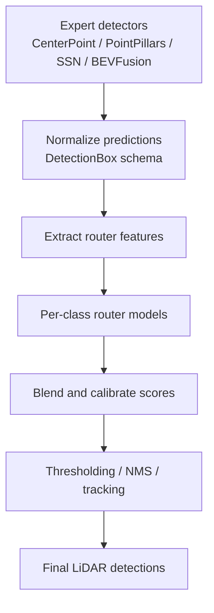
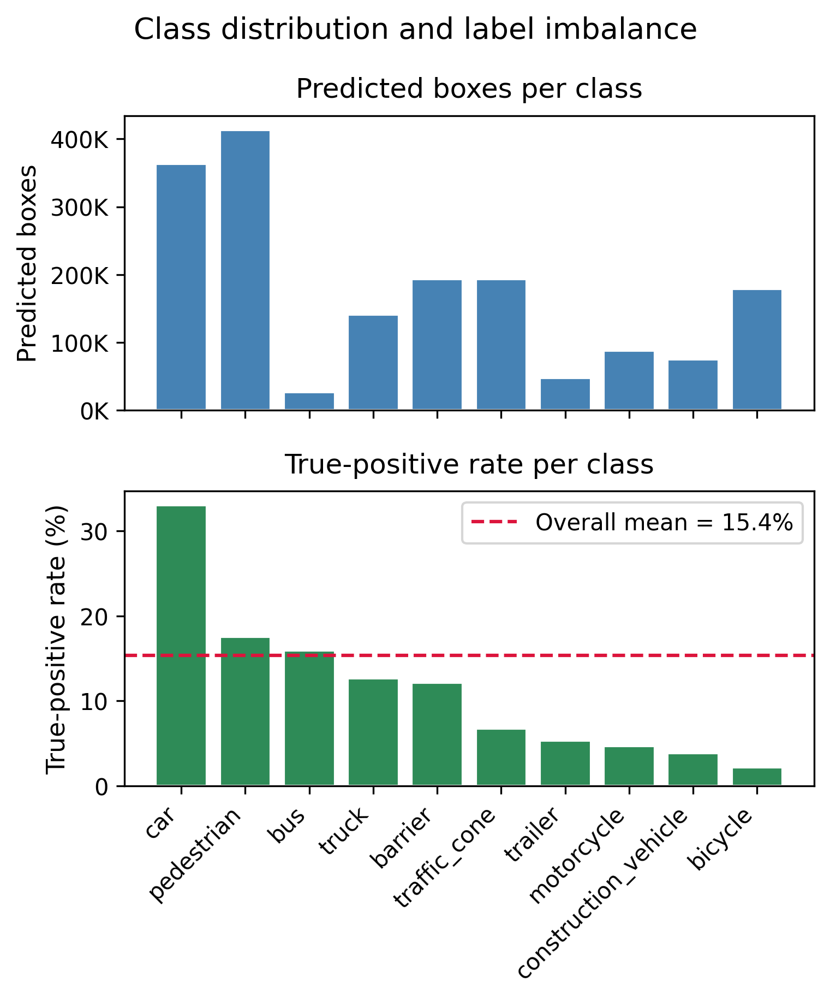
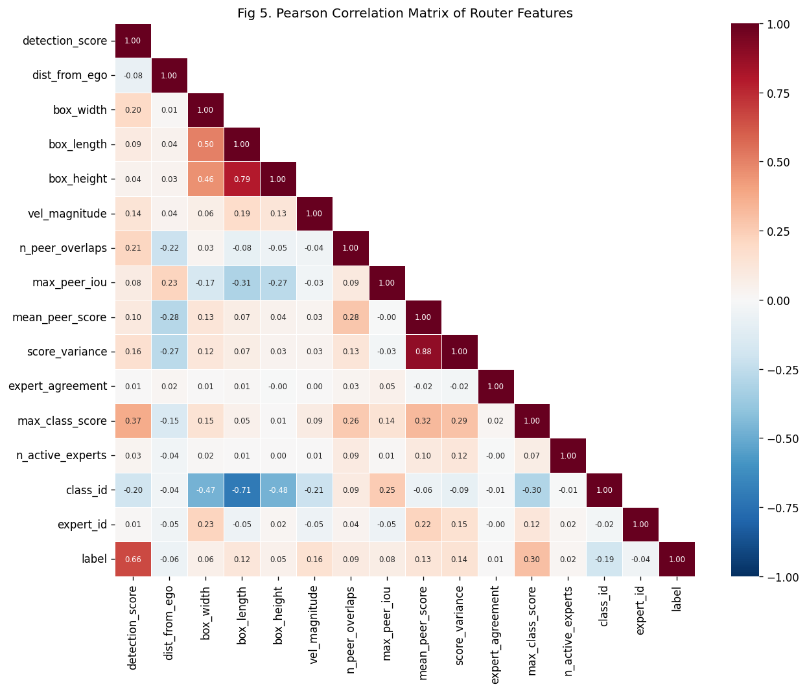
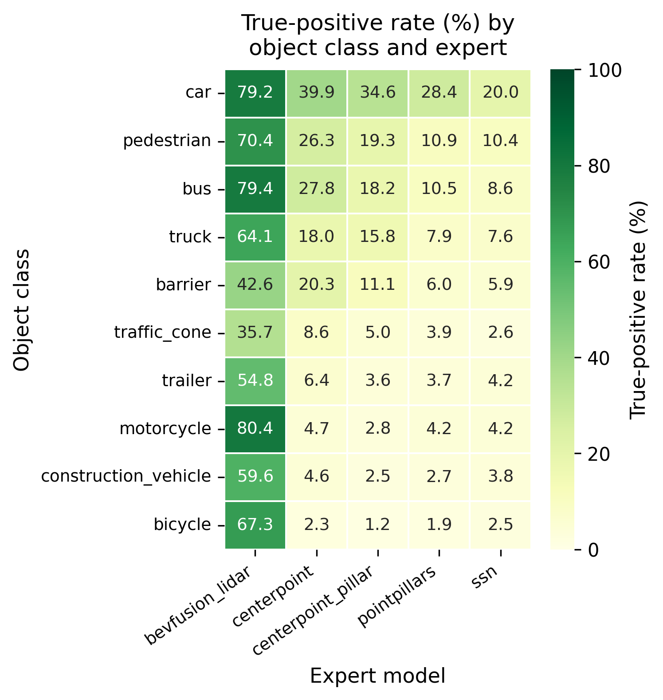
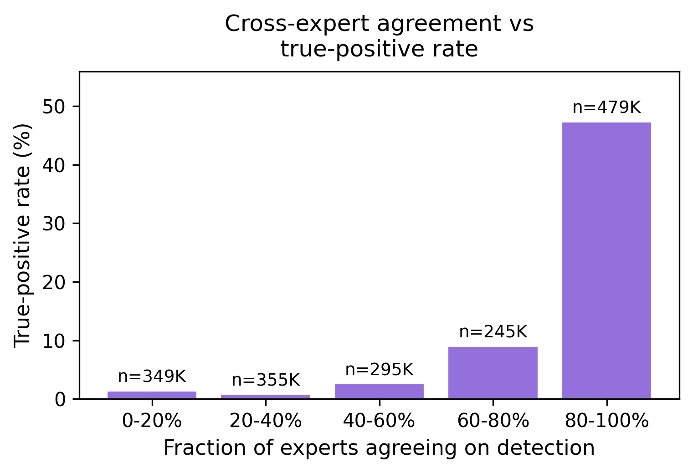

# MoE LiDAR Detection

Output-level Mixture of Experts for LiDAR 3D object detection. This project fuses predictions from multiple expert detectors, including CenterPoint, PointPillars, SSN, and BEVFusion-LiDAR, through a learned per-class router designed for the nuScenes benchmark.

## Project overview

This repository implements a research-oriented LiDAR detection pipeline that improves 3D object detection quality by combining expert predictions instead of relying on a single detector. The central idea is simple but powerful: each candidate detection is scored by a router model that estimates whether it is a true positive, and those router scores are then used to refine the final ensemble output.

## What we are trying to achieve

The goal is to build a more reliable and accurate 3D object detection system by:

- improving precision over single-expert baselines,
- reducing false positives through learned routing,
- improving detection robustness across object classes,
- producing a modular and configurable pipeline suitable for experimentation.

## How we are achieving it

The project uses a mixture-of-experts strategy with the following workflow:

1. Multiple expert detectors generate candidate 3D boxes.
2. Every box is normalized into a common internal representation.
3. Router features are extracted from each candidate box.
4. Per-class router models estimate the probability that each box is a true positive.
5. Scores are blended, thresholded, and post-processed into the final detections.

## System architecture



## Working methodology

### 1. Data preparation

The project uses prebuilt router training and calibration datasets stored as CSV files. Each row corresponds to one candidate detection box and includes labels, expert metadata, and feature values used by the router.

### 2. Feature engineering

The router consumes a rich set of features such as:

- detection confidence,
- distance from ego vehicle,
- box geometry,
- velocity-related descriptors,
- overlap and agreement statistics between experts,
- map-based priors when available.

These features help the router reason about whether a detected object is likely to be real.

### 3. Router training

The repository supports two router families:

- XGBoost-based per-class routers for strong tabular-model performance,
- neural-network routers based on FT-Transformer architectures for deeper interaction modeling.

### 4. Ensemble inference

During inference, the router scores are combined with expert confidence values to produce a calibrated, class-aware final score for each candidate box.

## Repository structure

- [src](src) — core implementation modules for feature extraction, fusion, routing, and utilities.
- [configs](configs) — configuration files for the final adopted pipeline.
- [training_data](training_data) — router training data and dataset documentation.
- [docs](docs) — figures and supporting project documentation.
- [notebook](notebook) — exploratory notebooks for data analysis and model evaluation.
- [model_weights](model_weights) — model artifacts and related assets.

## Setup guide

### Prerequisites

- Python 3.9 or newer
- pip
- Optional: CUDA-capable GPU for faster training

### 1. Create a virtual environment

```bash
python3 -m venv aai590Ve
source aai590Ve/bin/activate
```

### 2. Install dependencies

```bash
pip install -r requirements.txt
```

### 3. Prepare the router datasets

The repository expects the router training and calibration CSV files to be available under:

```bash
training_data/router_data/train.csv
training_data/router_data/eval.csv
```

These files are large and are not stored directly in the repository. Download or place them in the folder before running training or EDA scripts.

### 4. Run the EDA workflow

```bash
python src/run_eda.py
```

This produces exploratory figures under [docs/figures](docs/figures).

## Visual insights and outputs

The project includes a set of generated analysis figures that help explain the behavior of the router and the data distribution.









## Project quality and engineering practices

This repository follows several professional software-development practices:

- modular code organization,
- clear docstrings and inline comments,
- configuration-driven experiments,
- reproducible and documented data splits,
- separation of data cleaning, modeling, and evaluation logic,
- headless plotting support for analysis scripts.

## Summary

This project is a practical and principled implementation of a LiDAR detection ensemble that uses learned routing to improve object-detection quality. It is designed not only to perform well, but also to be understandable, extensible, and suitable for further experimentation.
