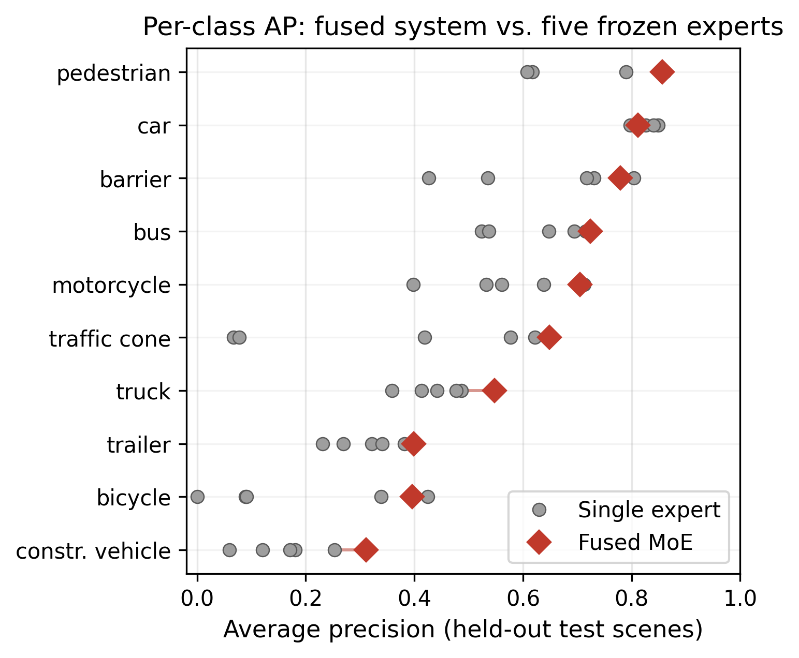
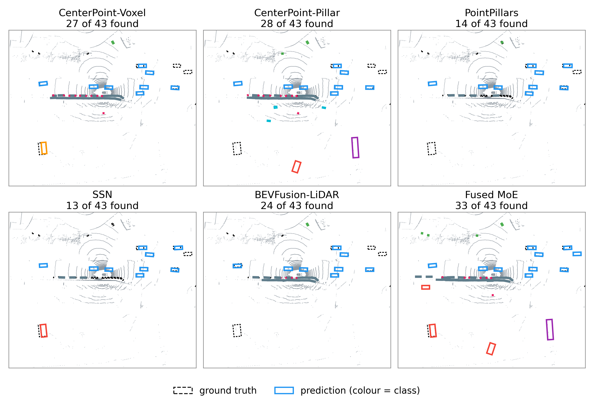
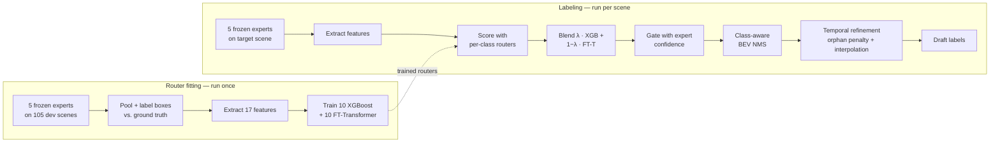

# MoE LiDAR Detection

Output-level Mixture of Experts for LiDAR 3D object detection on nuScenes. Five frozen, pretrained detectors are pooled, and a learned per-class router decides which of their candidate boxes to keep — producing draft labels better than any single detector alone, without retraining a single backbone.

**Result:** mAP **0.6179** / NDS **0.6761** on 45 scene-disjoint held-out evaluation scenes, **+1.70 pp mAP** over the best single expert.

- Main notebook: [notebook/model_training_evaluation.ipynb](notebook/model_training_evaluation.ipynb)
- Adopted configuration: [configs/moe_final.yaml](configs/moe_final.yaml)

---

## Table of contents

- [Problem and approach](#problem-and-approach)
- [Results](#results)
- [System architecture](#system-architecture)
- [Repository contents](#repository-contents) ← file-by-file descriptions
- [Setup](#setup)
- [Running the project](#running-the-project)
- [Data and model artifacts](#data-and-model-artifacts)
- [Testing](#testing)
- [AI tool disclosure](#ai-tool-disclosure)
- [Authors](#authors)

---

## Problem and approach

Annotating LiDAR point clouds with 3D boxes is one of the costliest steps in building an autonomous-driving dataset. Running a pretrained detector first and having a human correct its output is the obvious way to cut that cost — but no single detector is best across every object category, so committing to one leaves the strengths of the rest unused.

This project asks whether the **outputs** of several architecturally diverse detectors can be fused by a learned per-class gate into an offline auto-labeling system that beats all of them. Because labeling runs in a data pipeline rather than on a moving vehicle, there is no per-frame latency budget: every expert runs on every frame, and later frames can be consulted as readily as earlier ones.

The five experts (all frozen, all from released checkpoints via MMDetection3D):

| Expert | Architecture | Standalone mAP |
|---|---|---|
| BEVFusion-LiDAR | BEV feature fusion, LiDAR-only | 0.6009 |
| CenterPoint-Voxel | Anchor-free, 0.075 m voxel | 0.5742 |
| CenterPoint-Pillar | Anchor-free, 0.2 m pillar | 0.4940 |
| SSN | Shape Signature Network | 0.4061 |
| PointPillars | Pillar encoder + 2D CNN | 0.3495 |

Every candidate box is scored by **two models per class** — an XGBoost classifier and an FT-Transformer — whose calibrated probabilities are blended per class, fused with the originating expert's own confidence, then passed through class-aware NMS and a non-causal temporal refinement step.

## Results

On the 45 held-out evaluation scenes (1,804 keyframes), never used for router fitting or hyperparameter calibration:

| Detector | mAP ↑ | NDS ↑ |
|---|---|---|
| **Fused mixture-of-experts** | **0.6179** | **0.6761** |
| BEVFusion-LiDAR | 0.6009 | 0.5863 † |
| CenterPoint-Voxel | 0.5742 | 0.6657 |
| CenterPoint-Pillar | 0.4940 | 0.6070 |
| SSN | 0.4061 | 0.5457 |
| PointPillars | 0.3495 | 0.5001 |

† BEVFusion-LiDAR has no velocity regression branch, so its NDS is not directly comparable.

The fused system is best on no single error dimension yet close to best on all five at once, which is what NDS rewards. It does not dominate every expert on every class — it reallocates accuracy toward the classes where the expert pool disagrees most.

<p align="center">
  
</p>

<p align="center">
  
</p>

## System architecture



Both phases run offline. See [docs/figures/fig9_architecture.png](docs/figures/fig9_architecture.png) for the full-resolution diagram.

---

## Repository contents

### Notebooks

| File | Description |
|---|---|
| [`notebook/model_training_evaluation.ipynb`](notebook/model_training_evaluation.ipynb) | **Main deliverable.** Trains the per-class XGBoost and FT-Transformer routers, evaluates them, diagnoses over/underfitting, runs scene-grouped cross-validation, and (behind a `RUN_FULL_PIPELINE` flag) executes the complete fusion pipeline end to end and scores it with the official nuScenes toolkit. |
| [`notebook/data_cleaning_eda.ipynb`](notebook/data_cleaning_eda.ipynb) | Data cleaning and exploratory analysis of the router dataset: class imbalance, per-expert precision, score distributions, feature–label correlation, and cross-expert agreement. Produces `fig1`–`fig8`. |

### Configuration

| File | Description |
|---|---|
| [`configs/moe_final.yaml`](configs/moe_final.yaml) | Single source of truth for every numeric constant in the adopted pipeline: per-class blend weights (λ), temperatures (τ), score thresholds, NMS IoU, matching criteria, and tracker gates. Extensively commented with the experiment that justified each value. |
| [`requirements.txt`](requirements.txt) | Python dependencies. |

### Core package — `src/`

| File | Description |
|---|---|
| [`src/io/schemas.py`](src/io/schemas.py) | `DetectionBox` dataclass — the common internal representation every expert's output is normalized into. Validates frame, size, quaternion, and score ranges; derives yaw. |
| [`src/io/load_predictions.py`](src/io/load_predictions.py) | Load expert prediction files in nuScenes submission JSON format into `DetectionBox` objects. |
| [`src/io/save_predictions.py`](src/io/save_predictions.py) | Serialize fused predictions back to nuScenes submission JSON. |
| [`src/moe/features.py`](src/moe/features.py) | Router feature extraction — the 17 model inputs (box geometry, peer-overlap consensus, uncertainty, map prior) computed per candidate box. Defines `FEATURE_NAMES` / `NN_FEATURE_NAMES`. |
| [`src/moe/router_dataset.py`](src/moe/router_dataset.py) | Builds the labeled router training table: pools expert predictions, matches each box to ground truth under the per-class criterion (BEV IoU ≥ 0.5 or center distance ≤ 2.0 m), and emits one labeled row per candidate. |
| [`src/moe/xgboost_router.py`](src/moe/xgboost_router.py) | Per-class XGBoost routers — training, sigmoid calibration for `bicycle`, and save/load. |
| [`src/moe/nn_router.py`](src/moe/nn_router.py) | Per-class FT-Transformer routers — feature tokenizer, transformer encoder, isotonic calibration, and save/load. |
| [`src/moe/infer_router.py`](src/moe/infer_router.py) | Applies trained routers to produce gated MoE predictions: blends the two scorers, gates against expert confidence, thresholds, and runs class-aware NMS. |
| [`src/moe/pipeline.py`](src/moe/pipeline.py) | End-to-end recipe for the adopted configuration — wires routers, fusion, NMS, and temporal refinement into one call (`run_final_pipeline`). |
| [`src/fusion/bev_iou.py`](src/fusion/bev_iou.py) | Axis-aligned bird's-eye-view IoU, single-pair and vectorized matrix forms. Carries a `HISTORY` block documenting why rotated IoU was tested and rejected. |
| [`src/fusion/nms3d.py`](src/fusion/nms3d.py) | Class-aware greedy 3D non-maximum suppression over `DetectionBox` lists. |
| [`src/fusion/tracker.py`](src/fusion/tracker.py) | Offline per-scene, per-class greedy BEV tracker plus the two temporal corrections: orphan-score penalty and single-gap track interpolation. |
| [`src/evaluation/evaluate_nuscenes.py`](src/evaluation/evaluate_nuscenes.py) | Wrapper around the official nuScenes detection evaluator; returns mAP, NDS, and the five true-positive error metrics. |
| [`src/utils/class_mapping.py`](src/utils/class_mapping.py) | Canonical nuScenes class names and the alias table used to normalize varied model outputs. |
| [`src/utils/bev_viz.py`](src/utils/bev_viz.py) | Static BEV rendering of predictions against ground truth, including the multi-panel per-expert comparison grid. |
| [`src/utils/logging_utils.py`](src/utils/logging_utils.py) | Structured logging setup shared across the package. |
| [`src/run_eda.py`](src/run_eda.py) | Headless script form of the EDA notebook — regenerates `fig1`–`fig8` into `docs/figures/` without a Jupyter session. Note: its `fig5` is the feature × feature correlation *matrix*, which is a different chart from `fig5_label_correlation.png` (the feature-vs-label bar chart the notebook produces). |

### Scripts — `scripts/`

| File | Description |
|---|---|
| [`scripts/eval_test_split.py`](scripts/eval_test_split.py) | Scores the fused submission and all five experts on the held-out test scenes; produces the mAP/NDS and true-positive error tables. |
| [`scripts/make_results_figures.py`](scripts/make_results_figures.py) | Builds the results figures (per-class AP, optimization trajectory, recovery-by-source) and prints the tables behind them. |
| [`scripts/make_architecture_figure.py`](scripts/make_architecture_figure.py) | Draws the system architecture diagram (`fig9_architecture.png`). |
| [`scripts/make_bev_figure.py`](scripts/make_bev_figure.py) | Renders the qualitative six-panel BEV comparison figure. |
| [`scripts/hw_monitor.py`](scripts/hw_monitor.py) | Samples GPU/CPU/memory state to a crash-durable CSV during long training runs. |

### Tests — `tests/`

| File | Description |
|---|---|
| [`tests/unit/test_schemas.py`](tests/unit/test_schemas.py) | `DetectionBox` validation and yaw derivation. |
| [`tests/unit/test_bev_iou.py`](tests/unit/test_bev_iou.py) | Single-pair and matrix BEV IoU against hand-computed overlaps. |
| [`tests/unit/test_nms3d.py`](tests/unit/test_nms3d.py) | Class-aware and class-agnostic suppression behavior. |
| [`tests/unit/test_moe_features.py`](tests/unit/test_moe_features.py) | Feature-vector construction, ordering, and peer-consensus statistics. |
| [`tests/unit/test_router_dataset.py`](tests/unit/test_router_dataset.py) | Ground-truth matching and row labeling under both criteria. |
| [`tests/unit/test_tracker.py`](tests/unit/test_tracker.py) | Track association, orphan penalty, and interpolation. |
| [`tests/unit/test_load_save.py`](tests/unit/test_load_save.py) | nuScenes JSON round-trip fidelity. |
| [`tests/unit/test_class_mapping.py`](tests/unit/test_class_mapping.py) | Canonical-name validation and alias resolution. |

### Documentation and data folders

| Path | Description |
|---|---|
| [`docs/expert_regeneration.md`](docs/expert_regeneration.md) | How to regenerate the five experts' prediction files from the original pretrained checkpoints via MMDetection3D. |
| [`docs/figures/`](docs/figures) | Analysis figures produced by the EDA and results scripts (`fig1`–`fig13`). |
| [`training_data/token_split_3way.json`](training_data/token_split_3way.json) | The scene-grouped 3-way split (85 fit / 20 calibration / 45 held-out) — the manifest that makes every result reproducible. |
| [`training_data/token_to_scene_map.json`](training_data/token_to_scene_map.json) | Keyframe token → scene token mapping, used for scene-grouped cross-validation. |
| [`training_data/README.md`](training_data/README.md) | Router CSV schema and download instructions. |
| [`predictions/README.md`](predictions/README.md) | Expert prediction files — download instructions and regeneration pointer. |
| [`model_weights/README.md`](model_weights/README.md) | Trained router weights — download instructions and loading example. |

---

## Setup

**Prerequisites:** Python 3.9+, pip. A CUDA-capable GPU is optional but substantially speeds up router training.

```bash
git clone <this-repo>
cd moe-lidar-detection

python3 -m venv .venv
source .venv/bin/activate

pip install -r requirements.txt
```

## Running the project

### 1. Verify the installation

```bash
pytest tests/ -q
```

All 101 unit tests run on synthetic fixtures and need none of the large data files — this is the fastest way to confirm a working checkout.

### 2. Train and evaluate the routers

Fetch `train.csv` and `eval.csv` into `training_data/router_data/` (see [`training_data/README.md`](training_data/README.md)), then run:

```bash
jupyter notebook notebook/model_training_evaluation.ipynb
```

Steps 1–4 train both router families, report per-class AP, and run the overfitting diagnostics and scene-grouped cross-validation. These steps need **only** the two CSVs.

### 3. Run the full fusion pipeline (optional)

Set `RUN_FULL_PIPELINE = True` in the notebook. This additionally requires the five experts' `predictions.json` files, the nuScenes `v1.0-trainval` metadata, and the map layers — and roughly 24 GB of peak host memory. It writes a submission JSON and scores it with the official nuScenes evaluator.

The nuScenes dataset is expected at `data/nuscenes/`. If yours lives elsewhere, point at it with an environment variable instead of editing any file — the notebook and every script in `scripts/` read it:

```bash
export NUSCENES_ROOT=/path/to/nuscenes
```

### 4. Regenerate the EDA figures

```bash
python src/run_eda.py
```

## Data and model artifacts

Three categories of large files are distributed outside git (they exceed GitHub's 100 MB limit) and are listed in `.gitignore`:

| Asset | Location | Size | Needed for |
|---|---|---|---|
| Router CSVs | `training_data/router_data/` | ~543 MB | All notebook steps |
| Expert predictions | `predictions/<expert>/predictions.json` | ~1.6 GB | Full pipeline only |
| Trained router weights | `model_weights/router_{xgboost,nn}/` | ~25 MB | Inference without retraining |

Each folder's `README.md` carries its download link and expected layout. The scene split manifests in `training_data/` **are** committed, so results remain reproducible against the same partitions.

## Testing

```bash
pytest tests/ -q          # all 101 tests
pytest tests/unit/test_bev_iou.py -v
```

The suite covers the pure-logic components — geometry, suppression, feature construction, ground-truth matching, tracking, and serialization — and runs in under a second.

---

## AI tool disclosure

Portions of this project were completed with the assistance of generative AI tools, disclosed in accordance with course policy.

- **Anthropic's Claude** (via the Cursor development environment and Claude Code) was used for code review and debugging of the routing and evaluation pipeline, for drafting and copy-editing prose, and for generating the Matplotlib code behind several figures.
- **OpenAI's ChatGPT** and **Google's Gemini** were used for literature discovery and for clarifying details of the nuScenes evaluation protocol.

All experimental design, implementation decisions, analysis, and conclusions are the authors' own. Every AI-generated suggestion was reviewed and tested before adoption, and all numerical results were produced by the authors' own code and verified against the project's experiment log.

## Authors

Santosh Kumar · Michael Rinaldi Domingo · Atul Prasad

Master of Science in Applied Artificial Intelligence, Shiley-Marcos School of Engineering, University of San Diego — AAI-590 Capstone.

## Acknowledgments

The authors thank Professor Anna Marbut for instructional feedback on earlier drafts of this project.

## License

This repository's original source code is licensed under the MIT License. See the [LICENSE](LICENSE) file for details.

Third-party assets and dependencies are not covered by this repository's MIT License. The nuScenes dataset, MMDetection3D, pretrained detector checkpoints, model weights, and other external components remain subject to their respective licenses and terms of use.
